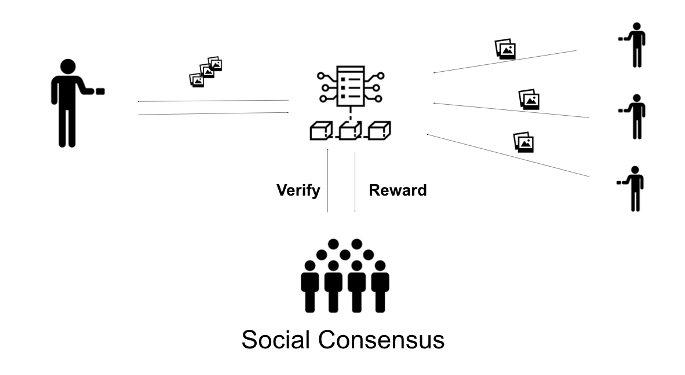

# BETHabase
### A distributed Marketplace for special image acquisition

#### Current Difficulties
##### Verifying datasets based on human input  
- Creating Databases is costly both money and time wise: Until now no incentivation mechanism for the broad masses participating in image collection  
- Information is hard to verify: Only big cooperation are eligible of acquiring verified datasets limiting democratisation of technological growth
- Feeding Deep Learning Algorithms: Finding big datasets of pictures for supervised learning algorithms are hard to acquire and end up being put together by Universities. How would you get 2000 pictures of hand images in front of an ATM machine?

#### A Decentralized Solution For The Information Exchange
##### Acquisition of verified data through social census 

- Democratization: Empower the free-flow of verified data, giving small research institutions the access to affordable datasets.
- Gamification: The reputation token system enables a social gamification. of any kind of task. 
Rank up and ladder up the ranking system of good behaviour
- Incentivizing honest collaboration

*Disclaimer: This project was built for the BETH Hackathon in just 2 days. Use in caution.* 
